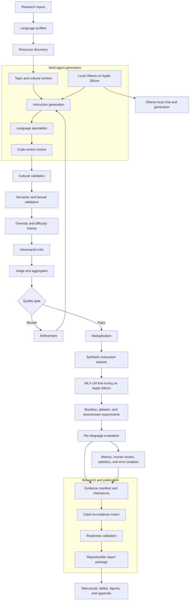

# SynthSEA Architecture

This diagram shows the complete research pipeline from language-aware inputs to the reproducible report package.

The four language settings remain separate throughout evaluation:
Singapore English/Singlish, Malay, Tamil, and Singapore-context Mandarin.
